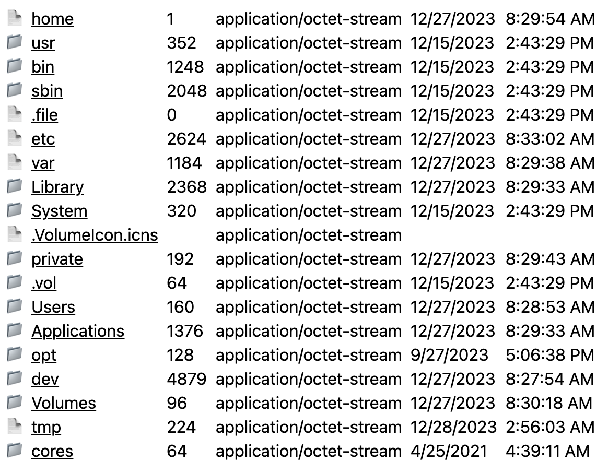

# Serve file system browser as a web page

This demo application exposes the `/fs/` endpoint serving the index
of the file system.

The application uses `Deno` runtime, `Hono` web framework and `nunjucks` templates.

## Usage

```bash
deno task dev
```

## Implementation

The crucial part of the application. The complete source is in the [repo](./main.ts).

```typescript
app.get(FS + "/*", (c) => {
    const path_ = decodeURI(c.req.path);
    const path = resolve(join("/", path_.slice(FS.length), "/"));
    const stat = Deno.statSync(path);
    if (stat.isDirectory) return c.html(directory(path));
    else {
        const { content, type } = file(path);
        return new Response(content, { headers: { "content-type": type } });
    }
});
```

## The example of the page


